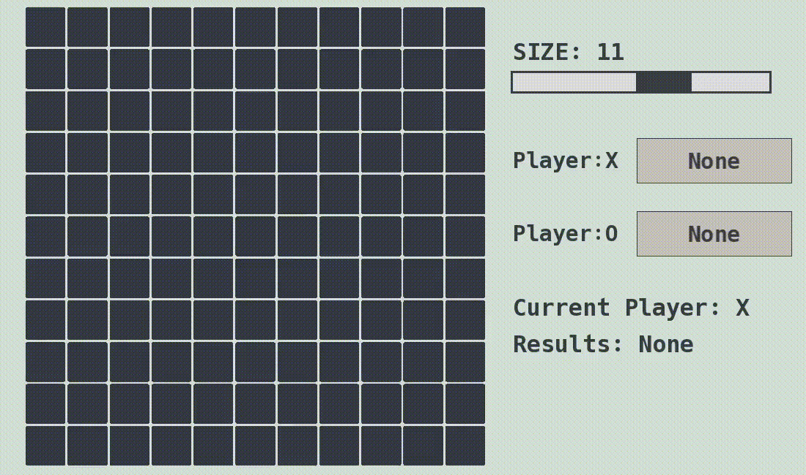

# Tic-Tac-Toe

This is a customizable Tic-Tac-Toe game developed in C++ using the SFML (Simple and Fast Multimedia Library). The game supports a variable board size with odd numbers greater than 1 (3x3, 5x5, 7x7, etc.), providing a flexible Tic-Tac-Toe experience.

## Features
- **Graphical User Interface**: 
    - Displays the game board dynamically based on the selected grid size.
    - Clear indicators for the current player and game results.

- **Custom User Controls**:
    - Size Selector: Change the grid size for games larger than the standard 3x3 (e.g., 5x5, 9x9) while reseting a new game at any point.
    - DIfferent Modes:
      - Human vs Human: Human plays against other human
      - Human vs AI: Human plays against AI with options to adjust its difficulty.
      - AI vs AI: Watch two AI players compete against each other.

- **Game Logic**:
    - Supports standard Tic-Tac-Toe rules for any grid size.
    - Alternates turns between two players (X and O).
    - Automatically detects win conditions, draws, and invalid moves.

## Demo

Here’s a quick preview of the game:




## Building the Project
**Note**: These instructions are specifically for Windows. For other platforms, adjust the paths and compilation steps accordingly.

### Requirements

- C++17 or higher
- SFML 2.6.1 or higher (prebuilt binaries)

### Setting up SFML
1. **Clone the project**:
   - Clone the repository from GitHub:
   ```bash
   git clone https://github.com/varun0138/Tic-tac-toe
   cd Tic-tac-toe
   ```

2. **Download SFML**: 
   - Download prebuilt binaries for SFML from the official [SFML website](https://www.sfml-dev.org/index.php).
   
3. **Configure your project**:
   - Extract the SFML binaries and place them in a folder (e.g., SFML-2.6.1).
   
4. **Add SFML to your environment**:
   - Update the `Makefile` included in the project with SFML libs and include paths.
   
   Example `Makefile`:
   ```makefile
   all: compile link run clean

   SFML_INCLUDE = C:/SFML-2.6.1/include
   SFML_LIB = C:/SFML-2.6.1/lib

   compile:
      g++ -c *.cpp gui/*.cpp -std=c++17 -g -Wall -m64 -I ${SFML_INCLUDE} -DSFML_STATIC

   link:
      g++ *.o -o main -L ${SFML_LIB}  -lsfml-graphics-s -lsfml-window-s -lsfml-system-s -lopengl32 -lfreetype -lwinmm -lgdi32 

   clean:
      del *.o *.exe
      
   run:
      ./main
5. **Compile the project**:
   ```
   make
## Troubleshooting

- **Missing dependencies**: Ensure the SFML library is correctly linked. If there are issues, verify the paths for the SFML `lib` and `include` folders are accurate.
- **Compiler errors**: Make sure you're using **C++17** or later, as the project may rely on language features introduced in these versions.

## Future Improvements
- **AI with Minimax Algorithm**: Implement an AI opponent using the Minimax algorithm for strategic gameplay.